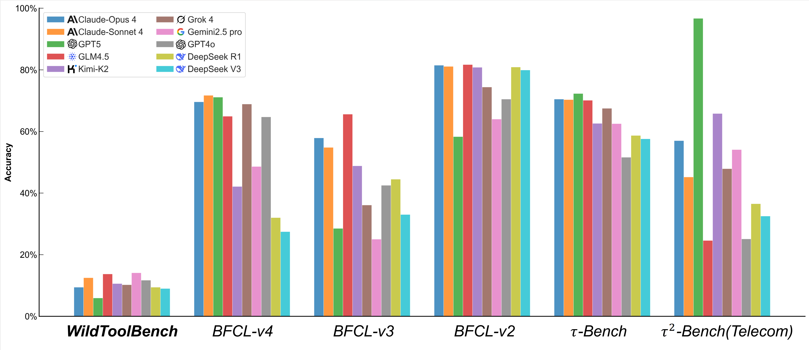

# Benchmarking LLM Tool-Use in the Wild


<p align="center">
    📖 <a>English</a> •
    <a href="README_ZH.md">中文</a> •
    📚 <a href="https://openreview.net/forum?id=yz7fL5vfpn">ICLR 2026 Paper</a> •
    🌐 <a href="https://yupeijei1997.github.io/WildToolBench/">Project Page</a>
</p>





## 📖 Overview

Fulfilling user needs through Large Language Model multi-turn, multi-step tool-use
is rarely a straightforward process. Real user interactions are inherently wild, being
unpredictable, messy, and flexible. We identify three key challenges from user
behaviour: compositional tasks that demand orchestration of tool-call topologies,
implicit intent spread across dialogue turns requiring contextual inference, and
instruction transition that mix task queries, clarifications, and casual conversation,
forcing LLMs to adjust their policies on the fly. Existing benchmarks overlook these
behaviors, causing the progress of LLMs observed on tool-use to be spurious. To
address this, we introduce WildToolBench, a LLM tool-use benchmark grounded in
real-world user behavior patterns. Comprehensive evaluations of 57 LLMs reveal
that no model achieves an accuracy of more than 15%, indicating a substantial
gap in the robustness of LLMs’ agentic ability. Controlled experiments and in-
depth analyses further indicate that the real challenge for LLM tool-use lies not in
artificially complex tasks, but in the wild nature of user behavior, emphasizing the
need to reconsider the interactions among LLMs, users, and tools.

## 😊 Key Materials

- Test data location: wild-tool-bench/data/Wild-Tool-Bench.jsonl
- More detailed information about the WildToolBench can be found below

## ⚡️ Quickstart

### Basic Installation

```bash
# Create a new Conda environment with Python 3.10
conda create -n WildToolBench python=3.10
conda activate WildToolBench

# Install the package
pip install -r requirements.txt
```

## ⏳ Inference

### 🤖 API Models
This project supports OpenAI-format API models.

Taking deepseek-chat as an example, refer to .env.example, create a .env file, and set the following keys.

```bash
DEEPSEEK_API_KEY=sk-XXXXXX
```

Afterwards, use the following code to request model results.

```bash
cd wild-tool-bench/

python3 -u -m wtb.openfunctions_evaluation --model=deepseek-chat
```

## 💫 Evaluation

Use the following code to evaluate the model's prediction results.

```bash
cd wild-tool-bench

python3 -u -m wtb.eval_runner --model=deepseek-chat
```

## 🧠 Controllable Multi Agent Data Generation Framework

### ⚡️ Quickstart

To generate English data using `deepseek-chat` as the base model for all agents, first refer to `.env.example` and create a `.env` file in the `multi-agent-framework/` directory with the following keys:

```bash
DEEPSEEK_API_KEY=sk-XXXXXX
LANGUAGE=en
```

The core innovation of this paper lies in the fact that our proposed WildToolBench is capable of covering all possible action spaces for any number of tasks, and except for the first round, all are true multi-turn tasks. Therefore, our framework can support the generation of data for any number of tasks. Here we take the generation of four tasks as an example, with the reference code as follows:
```bash
cd multi-agent-framework

python3 generate.py \
    --layer-num-total 4 \
    --user-model "deepseek-chat" \
    --planner-model "deepseek-chat" \
    --tool-model "deepseek-chat" \
    --agent-model "deepseek-chat" \
    --checker-model "deepseek-chat"
```
In particular, we have preserved data in three formats, including: raw generated data, streamlined data (with checker messages and role-switch messages removed), and captured data from each agent, available for researchers in need.

Finally, let's showcase a portion of the results generated for an actual case. It can be observed that the Continue Question User Agent has generated a true multi-turn task of implicit type, "Who is the uploader of the third wallpaper?" This implies that in order to solve this task, the model needs to refer to the preceding context to obtain the ID 778899 of the third wallpaper, and then continue to invoke the tool getWaifuDetails to retrieve detailed information about the wallpaper.

```
User: I need the latest 5 anime wallpapers.

Planner：getWaifuImages(limit=5, tags=["anime wallpapers"])

Tool：...

Planner：prepare_to_answer(answer_type=tool)

AI:

Here are the latest 5 anime wallpapers:
1. Wallpaper ID: 112233
 - [View Wallpaper](https://wallhaven.cc/w/112233)
 - 
 - Resolution: 1920x1080
2. Wallpaper ID: 445566
 - [View Wallpaper](https://wallhaven.cc/w/445566)
 - 
 - Resolution: 2560x1440
3. Wallpaper ID: 778899
 - [View Wallpaper](https://wallhaven.cc/w/778899)
 - 
 - Resolution: 3840x2160
4. Wallpaper ID: 101112
 - [View Wallpaper](https://wallhaven.cc/w/101112)
 - 
 - Resolution: 1920x1080
5. Wallpaper ID: 131415
 - [View Wallpaper](https://wallhaven.cc/w/131415)
 - 
 - Resolution: 2560x1440

You can click on the links to view the full wallpapers. Hope you enjoy these wallpapers! If you need more help, please let me know.

Continue Question User Agent Generate:
User: Who is the uploader of the third wallpaper?

Planner：getWaifuDetails(image_id=778899)
```

## 📝 Citation

If you find WildToolBench useful in your research, please consider citing our paper:

```bibtex
@inproceedings{
  yu2026wildtoolbench,
  title={Benchmarking {LLM} Tool-Use in the Wild},
  author={Peijie Yu and Wei Liu and Yifan Yang and Jinjian Li and Zelong Zhang and Xiao Feng and Feng Zhang},
  booktitle={The Fourteenth International Conference on Learning Representations},
  year={2026},
  url={https://openreview.net/forum?id=yz7fL5vfpn}
}
```
